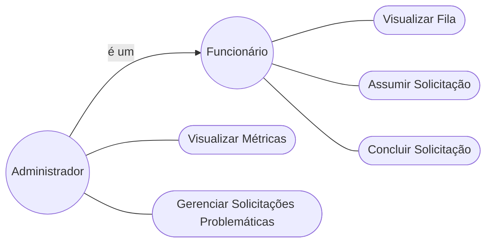

# Modelagem de Casos de Uso

## 1. Diagrama de Casos de Uso

## 2. Especificação (Exemplo)

# UC001 - Visualizar Fila de Solicitações

**Ator:** Funcionário

**Objetivo:** Consultar as solicitações disponíveis para marcação.

**Fluxo Principal:**

1. Funcionário acessa a fila geral.
2. Sistema exibe as solicitações ordenadas.
3. Funcionário visualiza os cards disponíveis.

---

# UC002 - Filtrar Solicitações

**Ator:** Funcionário

**Objetivo:** Localizar solicitações relevantes para sua área de atuação.

**Fluxo Principal:**

1. Funcionário seleciona filtros.
2. Sistema atualiza a lista.
3. Funcionário visualiza apenas as solicitações desejadas.

**Exemplos de filtros:**

* Tipo de exame;
* Município;
* Faixa etária;
* Prioridade.

---

# UC003 - Assumir Solicitação

**Ator:** Funcionário

**Objetivo:** Tornar-se responsável por uma solicitação.

**Fluxo Principal:**

1. Funcionário seleciona um card.
2. Sistema verifica disponibilidade.
3. Sistema atribui a solicitação ao funcionário.
4. Solicitação é movida para "Minha Área".

**Fluxo Alternativo:**

1. Funcionário possui mais de 4 solicitações em andamento.
2. Sistema exibe alerta de confirmação.
3. Funcionário confirma ou cancela a ação.

---

# UC004 - Consultar Detalhes da Solicitação

**Ator:** Funcionário

**Objetivo:** Obter informações necessárias para realizar a marcação.

**Fluxo Principal:**

1. Funcionário seleciona uma solicitação.
2. Sistema exibe:

   * Nome do paciente;
   * Número do prontuário;
   * Exame solicitado;
   * unidade executora;
   * localização

---

# UC005 - Devolver Solicitação à Fila

**Ator:** Funcionário

**Objetivo:** Remover uma solicitação de sua responsabilidade.

**Fluxo Principal:**

1. Funcionário seleciona a opção "Devolver".
2. Sistema remove o vínculo com o funcionário.
3. Solicitação retorna à fila geral.

---

# UC006 - Concluir Solicitação

**Ator:** Funcionário

**Objetivo:** Registrar que a marcação foi realizada.

**Fluxo Principal:**

1. Funcionário acessa os detalhes da solicitação.
2. Realiza a marcação no AGHU.
3. Seleciona a opção "Concluir".
4. Sistema move a solicitação para o status "Concluído".

---

# UC007 - Reportar Problema na Solicitação

**Ator:** Funcionário

**Objetivo:** Informar inconsistências que impedem a marcação.

**Fluxo Principal:**

1. Funcionário acessa os detalhes da solicitação.
2. Seleciona "Reportar Problema".
3. Informa o motivo.
4. Sistema registra a ocorrência.
5. Solicitação é encaminhada para área do administrador.

---

# UC008 - Visualizar Métricas Operacionais

**Ator:** Administrador

**Objetivo:** Monitorar o desempenho operacional do processo.

**Fluxo Principal:**

1. Administrador acessa a Central Administrativa.
2. Sistema apresenta indicadores operacionais.

---

# UC009 - Gerenciar Solicitações Problemáticas

**Ator:** Administrador

**Objetivo:** Resolver solicitações que apresentaram inconsistências.

**Fluxo Principal:**

1. Administrador acessa a lista de problemas reportados.
2. Analisa a justificativa.
3. Realiza o tratamento necessário.
4. Solicitação é movida para área de concluída com uma tag de 'Problemática' e deixando claro o motivo.

---

# UC0010 - Liberar Solicitações Bloqueadas

**Ator:** Administrador

**Objetivo:** Liberar solicitações que permaneceram muito tempo atribuídas a um funcionário.

**Fluxo Principal:**

1. Sistema identifica solicitações acima do tempo limite.
2. Administrador seleciona a solicitação.
3. Sistema remove a atribuição atual.
4. Solicitação retorna à fila geral.

**Fluxo Alternativo:**
3. o Administrador escolhe um novo responsável.
4. Sistema atualiza a atribuição.