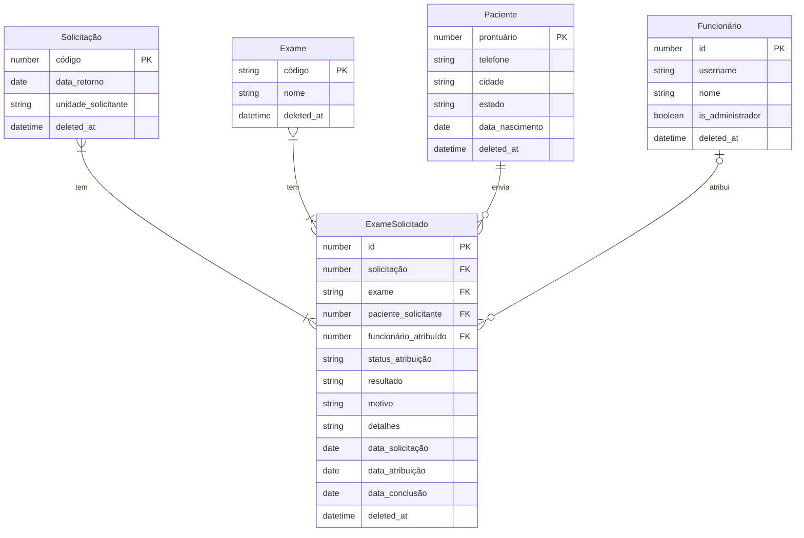

# Modelo de Dados e Dicionário

## 1. Modelo Entidade-Relacionamento


## 2. Dicionário de Dados

### Tabela Paciente
```json
{
  "$schema": "http://json-schema.org/draft-07/schema#",
  "title": "Paciente",
  "type": "object",
  "properties": {
    "prontuario": { "type": "number" },
    "telefone": { "type": "string" },
    "cidade": { "type": "string" },
    "estado": { "type": "string" },
    "data_nascimento": { "type": "string", "format": "date" },
    "deleted_at": { "type": "string", "format": "date-time", "description": "Soft delete — nulo se ativo" }
  },
  "required": ["prontuario", "telefone", "cidade", "estado"]
}
```

### Tabela Solicitação
```json
{
  "$schema": "http://json-schema.org/draft-07/schema#",
  "title": "Solicitacao",
  "type": "object",
  "properties": {
    "codigo": { "type": "number" },
    "data_retorno": { "type": "string", "format": "date" },
    "unidade_solicitante": { "type": "string" },
    "deleted_at": { "type": "string", "format": "date-time", "description": "Soft delete — nulo se ativo" }
  },
  "required": ["codigo", "data_retorno", "unidade_solicitante"]
}
```

### Tabela Exame
```json
{
  "$schema": "http://json-schema.org/draft-07/schema#",
  "title": "Exame",
  "type": "object",
  "properties": {
    "codigo": { "type": "string" },
    "nome": { "type": "string" },
    "deleted_at": { "type": "string", "format": "date-time", "description": "Soft delete — nulo se ativo" }
  },
  "required": ["codigo", "nome"]
}
```

### Tabela Funcionário
```json
{
  "$schema": "http://json-schema.org/draft-07/schema#",
  "title": "Funcionario",
  "type": "object",
  "properties": {
    "id": { "type": "number" },
    "username": { "type": "string", "description": "Login do AD (sAMAccountName), chave que liga o JWT ao registro no banco" },
    "nome": { "type": "string", "description": "Nome de exibição vindo do displayName do AD, preenchido na primeira ação do funcionário" },
    "is_administrador": { "type": "boolean", "description": "Define se o funcionário tem acesso ao painel de administração" },
    "deleted_at": { "type": "string", "format": "date-time", "description": "Soft delete — nulo se ativo" }
  },
  "required": ["id"]
}
```

### Tabela ExameSolicitado
```jsonc
{
  "$schema": "http://json-schema.org/draft-07/schema#",
  "title": "ExameSolicitado",
  "type": "object",
  "properties": {
    "id": { "type": "number" },
    "solicitacao": { "type": "number", "description": "FK -> Solicitacao.codigo" },
    "exame": { "type": "string", "description": "FK -> Exame.codigo" },
    "paciente_solicitante": { "type": "number", "description": "FK -> Paciente.prontuario" },
    "funcionario_atribuido": { "type": "number", "description": "FK -> Funcionario.id — nulo enquanto PENDENTE" },
    "status_atribuicao": {
      "type": "string",
      "enum": ["PENDENTE", "EM_ANDAMENTO", "AGUARDANDO_CONFIRMACAO", "FINALIZADO"]
    },
    "resultado": {
      "type": "string",
      "enum": ["CONFIRMADO", "PROBLEMA_REPORTADO"],
      "description": "Preenchido apenas quando status_atribuicao = FINALIZADO"
    },
    "motivo": { "type": "string", "description": "Motivo da devolução ou do problema reportado" },
    "detalhes": { "type": "string", "description": "Detalhes opcionais do problema reportado" },
    "data_solicitacao": { "type": "string", "format": "date", "description": "Data em que o exame entrou na fila" },
    "data_atribuicao": { "type": "string", "format": "date", "description": "Data em que foi atribuído ao funcionário" },
    "data_conclusao": { "type": "string", "format": "date", "description": "Data em que foi finalizado" },
    "deleted_at": { "type": "string", "format": "date-time", "description": "Soft delete — nulo se ativo" }
  },
  "required": ["solicitacao", "exame", "paciente_solicitante", "data_solicitacao"]
}
```

## 3. Regras de Integridade
* Logs obrigatórios e proibição de exclusão física.
