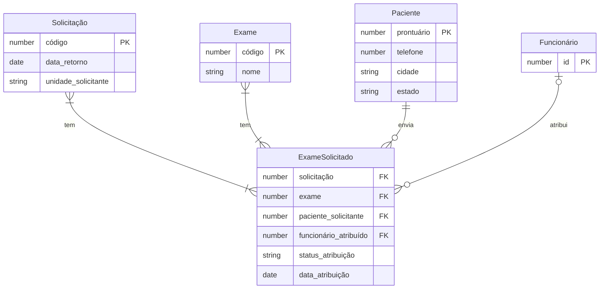

# Modelo de Dados e Dicionário

## 1. Modelo Entidade-Relacionamento


## 2. Dicionário de Dados
* Tabela PACIENTES, PRONTUARIOS, etc.

### [SCHEMA] Esquema JSON - Paciente
```json
{
  "$schema": "http://json-schema.org/draft-07/schema#",
  "title": "Paciente",
  "type": "object",
  "properties": {
    "nome": { "type": "string", "minLength": 3 },
    "cpf": { "type": "string", "pattern": "^[0-9]{11}$" },
    "cns": { "type": "string", "pattern": "^[0-9]{15}$" },
    "data_nascimento": { "type": "string", "format": "date" }
  },
  "required": ["nome", "cpf", "data_nascimento"]
}
```

## 3. Regras de Integridade
* Logs obrigatórios e proibição de exclusão física.
