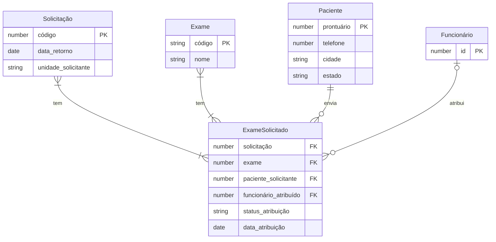

# Modelo de Dados e Dicionário

## 1. Modelo Entidade-Relacionamento


## 2. Dicionário de Dados

### Tabela Paciente
```json
{
  "$schema": "http://json-schema.org/draft-07/schema#",
  "title": "Paciente",
  "type": "object",
  "properties": {
    "prontuario": { "type": "number" },
    "telefone": { "type": "number", "minLength": 10, "maxLength": 11 },
    "cidade": { "type": "string" },
    "estado": { "type": "string" }
  },
  "required": ["prontuario", "telefone", "cidade", "estado"]
}
```

### Tabela Solicitação
```json
{
  "$schema": "http://json-schema.org/draft-07/schema#",
  "title": "Solicitacao",
  "type": "object",
  "properties": {
    "codigo": { "type": "number" },
    "data_retorno": { "type": "string", "format": "date" },
    "unidade_solicitante": { "type": "string" }
  },
  "required": ["codigo", "data_retorno", "unidade_solicitante"]
}
```

### Tabela Exame
```json
{
  "$schema": "http://json-schema.org/draft-07/schema#",
  "title": "Exame",
  "type": "object",
  "properties": {
    "codigo": { "type": "string" },
    "nome": { "type": "string" }
  },
  "required": ["codigo", "nome"]
}
```

### Tabela Funcionário
```json
{
  "$schema": "http://json-schema.org/draft-07/schema#",
  "title": "Funcionario",
  "type": "object",
  "properties": {
    "id": { "type": "number" }
  },
  "required": ["id"]
}
```

### Tabela ExameSolicitado
```jsonc
{
  "$schema": "http://json-schema.org/draft-07/schema#",
  "title": "ExameSolicitado",
  "type": "object",
  "properties": {
    "solicitacao": { "type": "number" },
    "exame": { "type": "string" }, 
    "paciente_solicitante": { "type": "number" },
    "funcionário_atribuído": { "type": "number" },
    "status_atribuicao": { "type": "string" },
    "data_atribuicao": { "type": "string", "format": "date" }
  },
  "required": ["solicitacao", "exame", "paciente_solicitante"]
}
```

## 3. Regras de Integridade
* Logs obrigatórios e proibição de exclusão física.
